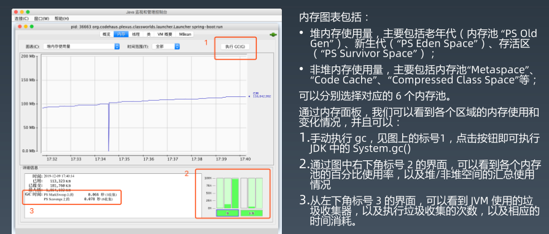
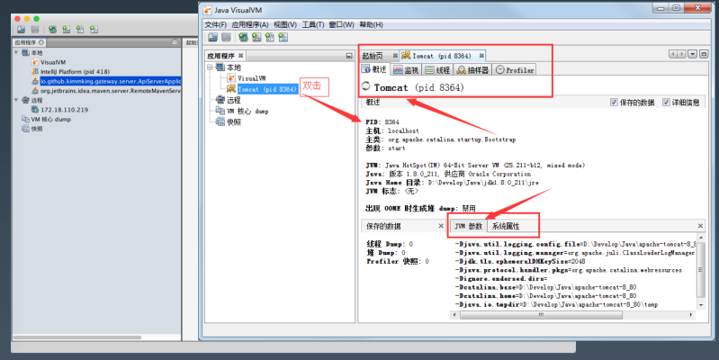
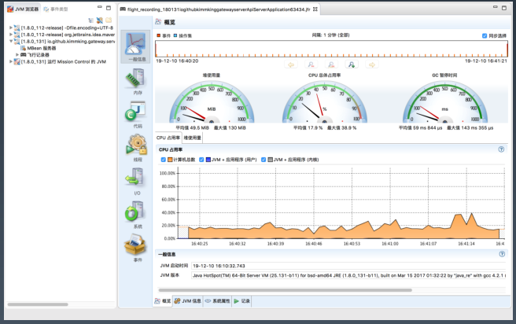
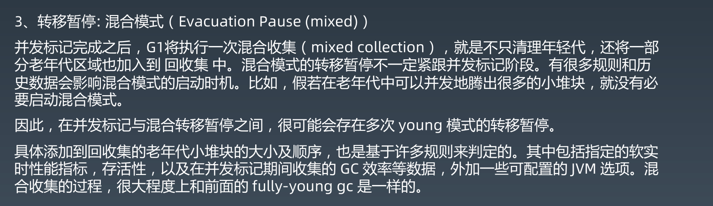
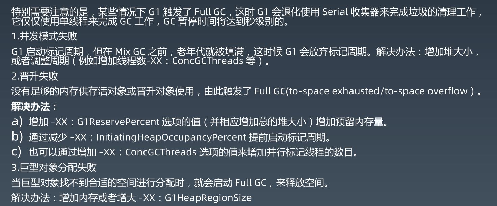

# 02、JVM 核心技术--工具与GC

## 一、内置命令行工具

- 应用相关的命令

  - `java` : 应用的启动程序
  - `javac` ： JDK 内置编译工具
  - `javap` ： 反编译 class文件的工具
  - `javadoc` ： 根据 java 代码和标准注释，自动生成相关的 API 说明文档

- JVM 相关

  - `jps、jinfo` ： 查看 java 进程

    - `jps -lmvV` : 查看启动的参数

  - `jstat` ：查看 JVM 内部 GC 相关信息

    

    - 例子 ： `jstat -gcutil -t -h 10 pid 10s 20`

      

    - 例子：`jstat -gc pid 1000 1000`

      

  - `jmap` ： 查看 heap 或者类占用空间统计

    - `jmap -heap pid` :  打印堆内存的配置信息和试用信息
    - `jmap -histo pid` ：看哪些类占用的空间最多
    - `jmap -dump:format=b,file=pid.hprof pid` : 到处堆内存数据

  - `jstack`： 查看线程信息

    - `jstack -l pid` ： （正常连接模式）长列表模式. 将线程相关的 locks 信息一起输出，比如持有的锁，等待的锁
    - `jstack -F pid`：（强制连接模式）在线程被 hung 住的时候 可以进行强制连接
    - `jstack -m pid`: （混合模式）将 Java 帧和 native 帧一起输出

  - `jcmd`：执行 JVM 相关分析命令（整合命令）

    - `jcmd pid VM.version` :  打印应用的虚拟机版本
    - `jcmd pid VM.flags`：打印 JVM 的配置参数
    - `jcmd  pid VM.command_line`：启动的命令行
    - `jcmd pid VM.system_properties` : 打印系统参数
    - `jcmd pid Thread.print`： 打印线程信息
    - `jcmd pid GC.class_histogram`：看哪些类占用的空间最多
    - `jcmd pid GC.heap_info`：打印堆信息

  - `jrunscript/jjs` ：执行 js 命令

## 二、图形化工具

- jconsole

  - 启动命令 ： `jconsole`

    

    

  

  

  

- jvisualvm

  - 启动命令：`jvisualvm`

  

  

  

  ​				

- jmc

  ​	

## 三、GC 的背景与一般原理

### 为什么会有GC？

本质上是内存资源的有限性，因此需要大家共享使用，手工申请，手动释放。

### GC 原理

#### 引用计数

#### 标记清除算法（Mark and Sweep）

#### 整理算法

比标记算法多了一步，需要进行数据整理压缩

#### 堆分代的思想

为什么老年代是通过移动的方式（类似剪切），而新生代是复制呢？

- 移动是有两个动作，复制+删除原有的。所以老年代在GC中的时候是移动，这样保证了移动后原有的位置不需要再次清除
- 而年轻代进行 YGC 的时候，Eden 区 和 存活区 复制到另个存活区，然后把之前的两个区全部清空，没必要用移动这种方式

#### 那些对象可以作为 GC Roots？

1. 当前正在执行的方法里的局部变量和输入参数
2. 活动线程（Active threads）
3. 所有类的静态字段（static field）
4. JNI 引用

进行 GC 的时候会 STW，堆中的数据全部暂停，提供给 GC 做标记。此阶段暂停的时间，与堆内存大小,对象的总数没有直接关系，而是由存活对象（alive objects）的数量来决定。所以增加堆内存的大小并不会直接影响标记阶段占用的时间。

## 四、串行 GC/并行 GC

### 串行GC （Serial GC）/ ParNewGC

串行：不能同一时刻同时做多件事情，而且一件事情必须从头做到底，才能做其他事情

并发：不能同一时刻同时做多件事情，但是多件事情可以拆分成多个环境，交替执行

并行：能够同一时刻处理多件事情

Serial GC：串行

ParNewGC：并发，Serial GC 的多线程版

### 并行 GC（Parallel GC）

##  五、CMS GC/G1 GC

### CMS GC（Mostly Concurrent Mark and Sweep Garbage Collector）

#### CMS GC 六个阶段

### G1 GC

#### G1 GC--配置参数

#### G1 GC 的处理步骤 

#### G1 GC 的注意事项

### 各个GC 的对比

### 常用的 GC 组合

### GC 如何选择

## ZGC/Shenandoah GC

### ZGC

### ShennandoahGC

### ShennandoahGC 与其他 GC 的 STW 比较

## 总结

