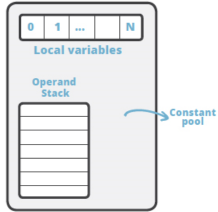
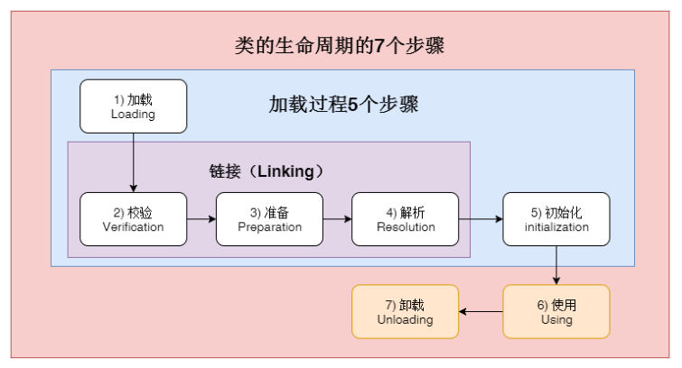
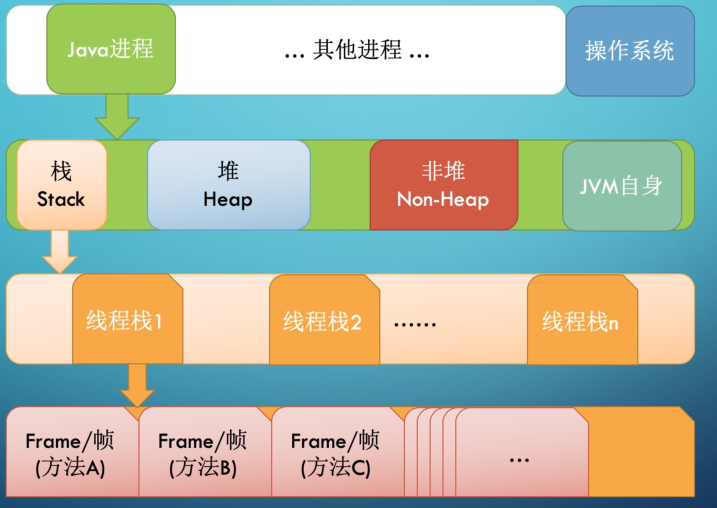
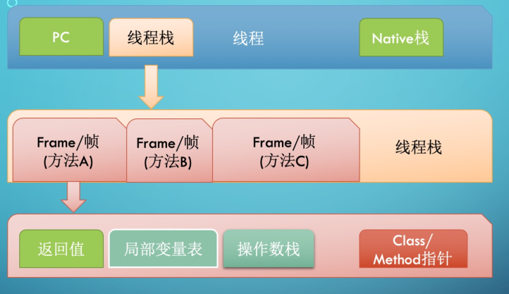
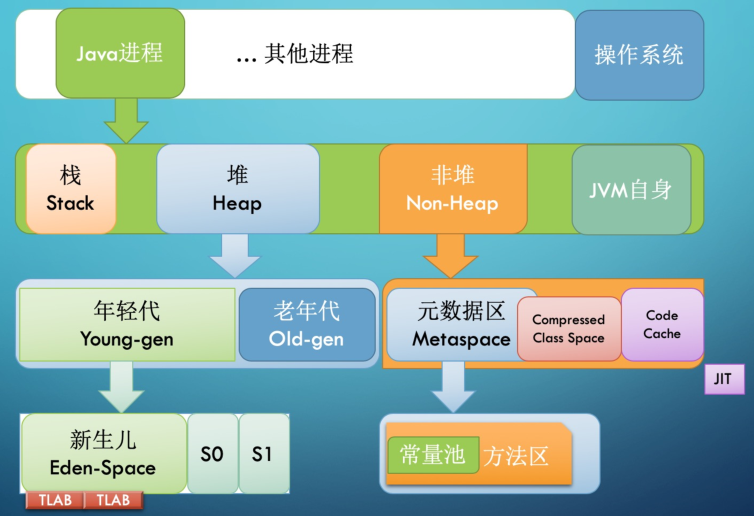
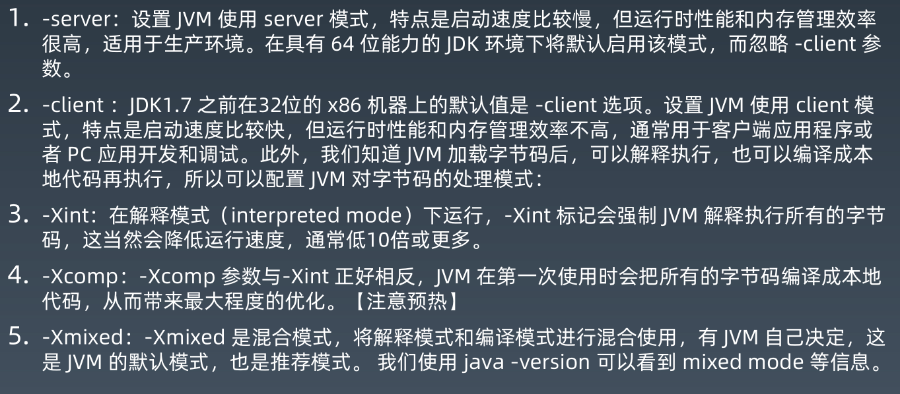
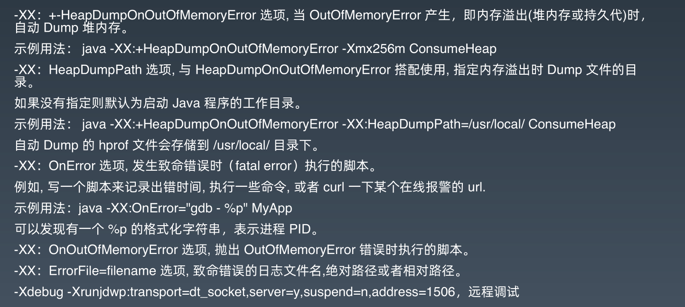
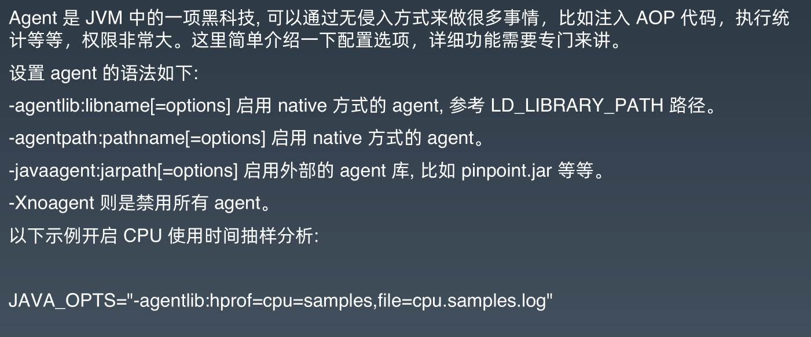

# 第一周：JVM 基础

## JVM 基础知识

### 编程语言

分类：

- 面向过程（C语言）、面向对象（Java）、面向函数（Kotlin、Python等）

- 静态类型（C、JAVA）、动态类型（Python、PHP）

  > 声明变量的时候是否要确定类型，确定就是静态类型，不用确定就是动态类型

  - 强类型（C++、Java、Python）、弱类型（PHP、JavaScript）

    > 强类型：可以隐式转换相关类型： float b  = 2.2(float) + 1(int） 
    >
    > 弱类型：可以隐式转换不相关类型： int b  = “5” + 1 

- 编译执行、解释执行

- 有GC、无GC

跨平台：

- 源代码跨平台 （C++）
  - 同一份代码在不同的平台上编译得到不同的运行文件，但是相同的功能
- 二进制跨平台 （Java）
  - 同一份二进制文件可以跑在不同平台上的虚拟机中，拥有相同的功能

## Java 字节码

Java bytecode 由单个字节（byte）的指令组成，理论上最多支持 256 个操作码。实际上 Java 只用了 200 左右的操作码，还有一些操作码则保留给调试操作。

### 分类

1. 栈操作指令，包括与局部变量交互的指令
2. 程序流程控制指令
3. 对象操作指令，包括方法调用指令
4. 算数运算以及类型转换指令

### 操作

```shell
javac xxx.java     # 编译
javap -c xxx.class # 查看字节码
javap -c -verbose xxx.class
```

### 字节码的运行结构

JVM 是基于栈的计算器。每一个线程都有一个独属于自己的线程栈（JVM Stack），用于存储栈帧（Frame）。

每一个方法的调用，JVM都会自动创建一个栈帧。

栈帧由操作数栈，局部变量数组以及一个Class引用组成。Class 引用指向当前方法运行时常量池中对应的 Class。

JVM Stack( Frame ( 操作数栈，局部变量数组，运行时常量池对应的Class) ，Frame（...）,...)



- 线程栈也叫做 Java 方法栈。线程执行过程中，一般会有多个方法组成调用栈（Stack Trace），比如 A 调用 B，B调用 C。。。每执行到一个方法，就会创建对应的 栈帧（Frame）

## JVM 类加载器

### 类的生命周期




1. 加载（Loading）：找到 Class 文件 加载到 JVM 中
2. 验证（Verification）: 验证格式、依赖
3. 准备（Preparation）：静态字段赋予初始化值（零值）、方法表
4. 解析（Resolution）：常量池中的符号引用转换为直接引用
5. 初始化（Initialization）：构造器、静态变量赋值、静态代码块
6. 使用（Using）
7. 卸载（Unloading）

### 类的加载时机

1. main函数所在的类
2. 关键字 new
3. 当调用静态方法的指令时，静态方法所在的类
4. 当访问静态字段的指令时，静态字段所在的类
5. 子类初始化的时候触发父类初始化
6. 接口定义了 defualt 方法，实现该接口的类初始化，会触发接口的初始化
7. 反射调用
8. 初次调用 MethodHandle，会触发方法指向的类初始化

### 不会初始化（可能会加载）

1. 子类应用父类的静态字段，只会触发父类的初始化，而不会触发子类的初始化
2. 定义对象数组，不会触发该类的初始化
3. 常量在编译期间会存入调用类的常量池中，本质上并没有直接引用定义常量的类，不
   会触发定义常量所在的类初始化 （解析阶段已经被替换）
4. 通过类名获取 Class 对象
5. 通过 Class.forName 加载类时，参数 initialize=false 不会触发初始化
6. 通过 ClassLoader默认的 loadClass 方法加载类，不会触发初始化

### 加载器

1. 启动类加载器（BootstrapClassLoader）
2. 扩展类加载器（ExtClassLoader）
3. 应用类加载器（AppClassLoader）

加载器特点：

- 双亲委托：类加载器加载类的时候，先由父加载器去加载，如果能加载对应到的类就加载，否则再由自身加载
- 负责依赖：在加载某个类的过程中可能需要加载依赖类的，也是通过双亲委托的方式
- 缓存加载：再加载的类未被清理的情况下，一个类加载器只能加同个类型的类一次

## 添加引用类的方式

- 放到 JDK 的 lib/ext 下，或者-Djava.ext.dirs (扩展类加载器加载)
- java –cp/classpath 或者 class 文件放到当前路径 （应用类加载器加载）
- 自定义 ClassLoader 加载
- 拿到当前执行类的 ClassLoader，反射调用 addUrl 方法添加 Jar 或路径(JDK9 无效，但是有更简单的方式)

## JVM 内存模型

### JVM 内存结构


1. 每一个线程都只能访问自己的线程栈
2. 每一个线程不能访问（看不见）其他线程的局部变量
3. 线程可以将一个原生变量值得<font color='orange'>副本</font>传给另一个线程，但是不能共享原生局部变量本身
4. 堆内存中包含了 Java 代码中创建的所有对象，不管是哪个线程创建的。
5. 不管是创建一个对象并将其赋值给局部变量， 还是赋值给另一个对象的成员变量， 创建的对象都会被保存到堆内存中
6. 如果是对象引用，则栈中的局部变量槽位中保存着对象的引用地址，而实际的对象内容保存在堆中
7. 对象的成员变量与对象本身一起存储在堆上, 不管成员变量的类型是原生数值，还是对象引用
8. 类的静态变量则和类定义一样都保存在堆中

总结：

1. 方法中使用的原生数据类型和对象引用地址在栈上存储；对象、对象成员与类定义、静态变量在堆上；
2. 堆共享，栈私有

### JVM 栈内存结构





- 一个线程栈有多个栈帧
- 一个栈帧包含返回值、 局部变量表、操作数栈和 Class/Method 指针
- 栈帧是一个逻辑上的概念，具体的大小在一个方法编写完成后基本上就能确定

### JVM 堆内存结构



- 堆内存是所有线程公用的内存空间，JVM 将 Heap 内存分为年轻代和老年代两部分
- 年轻代还划分为 3 个内存池，新生代和 存活区，大部分 GC 算法中有两个存活区（S0 和 S1），S0 和 S1 总有一个是空的，一般存活区比较小，不会浪费多少空间
- 非堆本质还是 Heap，只是一般不归 GC 管理，里面划分为 3 个内存池
  - Metaspace，元空间
  - CCS, Compressed Class Space，存放 class 信息和 Metaspace 有交叉
  - Code Cache，存放 JIT 编译器编译后的本地机器代码

### 小结，什么是JMM？

- JMM 规范明确定义了不同的线程之间，通过哪些方式，在什么时候可以看见其他线程保存到共享变量中的值；以及在必要时，如何对共享变量的访问进行同步。这样的好处是屏蔽各种硬件平台和操作系统之间的内存访问差异，实现了 Java 并发程序真正的跨平台。

- 所有的对象(包括内部的实例成员变量)，static 变量，以及数组，都必须存放到堆内存中

- 局部变量，方法的形参/入参，异常处理语句的入参不允许在线程之间共享，所以不受内存模型的影响
- 多个线程同时对一个变量访问时【读取/写入】，这时候只要有某个线程执行的是写操作，那么这种现象就称之为“冲突”

- 可以被其他线程影响或感知的操作，称为线程间的交互行为， 可分为： 读取、写入、同步操作、外部操作等等。 其中同步操作包括：对 volatile 变量的读写，对管程（monitor）的锁定与解锁，线程的起始操作与结尾操作，线程启动和结束等等。 外部操作则是指对线程执行环境之外的操作，比如停止其他线程等等。

- JMM 规范的是线程间的交互操作，而不管线程内部对局部变量进行的操作。

##  JVM 启动参数

- -D 设置系统属性
- -X 开头为非标准参数

- –XX 非稳定参数

### 系统属性

命令行

```shell
-Dfile.encoding=UTF-8
-Duser.timezone=GMT+08
-Dmaven.test.skip=true
-Dio.netty.eventLoopThreads=8
```

代码

```java
System.setProperty("a","A100");
String a=System.getProperty("a");
```

### 运行模式



### 堆内存

- <font color='orange'>-Xmx</font>，指定最大堆内存。 如 -Xmx4g. 这只是限制了 Heap 部分的最大值为4g。这个内存不包括栈内存，也不包括堆外使用的内存和非堆内存
- <font color='orange'>-Xms</font>，指定堆内存空间的初始大小。 如 -Xms4g。 而且指定的内存大小，并不是操作系统实际分配的初始值，而是GC先规划好，用到才分配。 <font color='orange'>专用服务器上需要保持 –Xms 和 –Xmx 一致，否则应用刚启动可能就有好几个 FullGC 当两者配置不一致时，堆内存扩容可能会导致性能抖动</font>。
- <font color='orange'>-Xmn</font>, 等价于 -XX:NewSize，使用 G1 垃圾收集器 不应该 设置该选项，在其他的某些业务场景下可以设置。官方建议设置为 -Xmx 的 1/2 ~ 1/4
- <font color='orange'>-XX：MaxPermSize=size</font>, 这是 JDK1.7 之前使用的。Java8 默认允许的Meta空间无限大，此参数无效。
- <font color='orange'>-XX：MaxMetaspaceSize=size</font>, Java8 默认不限制 Meta 空间, 一般不允许设置该选项
- <font color='orange'>-XX：MaxDirectMemorySize=size</font>，系统可以使用的最大堆外内存，这个参数跟 -Dsun.nio.MaxDirectMemorySize 效果相同
- <font color='orange'>-Xss</font>, 设置每个线程栈的字节数。 例如 -Xss1m 指定线程栈为 1MB，与-XX:ThreadStackSize=1m 等价

### GC

-XX：+UseG1GC：使用 G1 垃圾回收器
-XX：+UseConcMarkSweepGC：使用 CMS 垃圾回收器
-XX：+UseSerialGC：使用串行垃圾回收器
-XX：+UseParallelGC：使用并行垃圾回收器

// Java 11+
-XX：+UnlockExperimentalVMOptions -XX:+UseZGC
// Java 12+
-XX：+UnlockExperimentalVMOptions -XX:+UseShenandoahGC

### 分析诊断



### JavaAgent

