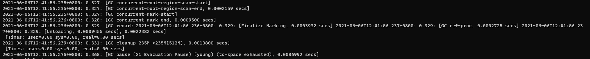
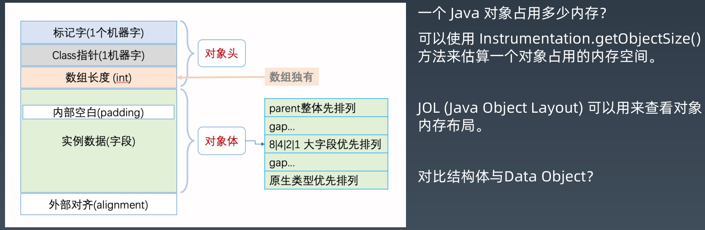

# 调优分析与面试经验

## GC 日志解读与分析

例子 `GCLogAnalysis.java`

```java

import java.util.Random;
import java.util.concurrent.TimeUnit;
import java.util.concurrent.atomic.LongAdder;
/*
演示GC日志生成与解读
*/
public class GCLogAnalysis {
    private static Random random = new Random();
    public static void main(String[] args) {
        // 当前毫秒时间戳
        long startMillis = System.currentTimeMillis();
        // 持续运行毫秒数; 可根据需要进行修改
        long timeoutMillis = TimeUnit.SECONDS.toMillis(1);
        // 结束时间戳
        long endMillis = startMillis + timeoutMillis;
        LongAdder counter = new LongAdder();
        System.out.println("正在执行...");
        // 缓存一部分对象; 进入老年代
        int cacheSize = 2000;
        Object[] cachedGarbage = new Object[cacheSize];
        // 在此时间范围内,持续循环
        while (System.currentTimeMillis() < endMillis) {
            // 生成垃圾对象
            Object garbage = generateGarbage(100*1024);
            counter.increment();
            int randomIndex = random.nextInt(2 * cacheSize);
            if (randomIndex < cacheSize) {
                cachedGarbage[randomIndex] = garbage;
            }
        }
        System.out.println("执行结束!共生成对象次数:" + counter.longValue());
    }

    // 生成对象
    private static Object generateGarbage(int max) {
        int randomSize = random.nextInt(max);
        int type = randomSize % 4;
        Object result = null;
        switch (type) {
            case 0:
                result = new int[randomSize];
                break;
            case 1:
                result = new byte[randomSize];
                break;
            case 2:
                result = new double[randomSize];
                break;
            default:
                StringBuilder builder = new StringBuilder();
                String randomString = "randomString-Anything";
                while (builder.length() < randomSize) {
                    builder.append(randomString);
                    builder.append(max);
                    builder.append(randomSize);
                }
                result = builder.toString();
                break;
        }
        return result;
    }
}
```

### GC日志分析

### 默认GC

```shell
java -XX:+PrintGCDetails GCLogAnalysis
```


以第一条 Minor GC 为例 解读一下

```java
[GC (Allocation Failure) [PSYoungGen: 63488K->10239K(73728K)] 63488K->19785K(241664K), 0.0053474 secs] [Times: user=0.06 sys=0.16, real=0.01 secs]
```

- GC (Allocation Failure)， 发生了一次 Minor GC
- PSYoungGen：GC策略是 Parallel Scavenge，与 ParNew（关注速度优先） 有一定的相似性，当该收集器关注的是“达到一个可控制的吞吐量”
- `63488K->10239K(73728K)`，<font color='orange'> GC 前年轻代使用的容量 -> GC 后年轻代使用的容量(年轻代总容量)</font>
- 63488K->19785K(241664K)，<font color='orange'>GC 前堆使用的容量 -> GC 后堆使用的容量（堆总容量）</font>
- 0.0053474 secs ，此次GC 内存区域GC耗时，单位是秒
- [Times: user=0.06 sys=0.16, real=0.01 secs] 
  - user=0.06，用户态消耗的时间
  - sys=0.16，内核态消耗的时间
  - real=0.01 ，总消耗的时间

以第一条 Full GC 为例 解读一下

```java
[Full GC (Ergonomics) [PSYoungGen: 10235K->0K(264192K)] [ParOldGen: 118369K->115264K(255488K)] 128605K->115264K(519680K), [Metaspace: 2616K->2616K(1056768K)], 0.0240603 secs] [Times: user=0.17 sys=0.03, real=0.02 secs]
```

- Full GC (Ergonomics), 发生一次Full GC
- [PSYoungGen: 10235K->0K(264192K)]：GC 策略是`Parallel Scaveng`,年轻代 GC 前使用容量 -> 年轻代 GC 后容量 （年轻总容量）
- [ParOldGen: 118369K->115264K(255488K)] ：老年代GC策略是 Parallel GC，老年代GC 前使用的容量 -> 老年代GC后的容量（老年代总容量）
-  128605K->115264K(519680K) ，堆 GC 前使用的容量 -> 堆 GC 后的容量（堆总容量）
- [Metaspace: 2616K->2616K(1056768K)]：元空间 GC 前使用的容量 -> 元空间 GC 后的容量（元空间总容量）
-  [Times: user=0.17 sys=0.03, real=0.02 secs]，分别为用户态、内核态 的消耗时间和总消耗时间

#### 模拟 OOM

```java
java -Xmx128m -XX:+PrintGCDetails GCLogAnalysis
```


#### 堆大小影响

改变-Xmx ：128m,512m,1024m,2048m,4086m,观察 GC 信息的不同

- GC 的 Minor GC 和 Full GC 次数都在减少
- 生成对象的次数存储增加

### 串行GC（Serial GC）

```java
java -XX:+UseSerialGC -Xms512m -Xmx512m -Xloggc:gc.demo.log -XX:+PrintGCDetails -XX:+PrintGCDateStamps GCLogAnalysis
```

```java
-- Young GC
2021-06-06T12:03:06.456+0800: 0.685: [GC (Allocation Failure) 2021-06-06T12:03:06.456+0800: 0.685: [DefNew: 139776K->17471K(157248K), 0.0073026 secs] 441891K->345000K(506816K), 0.0074343 secs] [Times: user=0.01 sys=0.00, real=0.01 secs]

-- Full GC
2021-06-06T12:03:06.488+0800: 0.717: [GC (Allocation Failure) 2021-06-06T12:03:06.488+0800: 0.717: [DefNew: 157247K->157247K(157248K), 0.0000265 secs]2021-06-06T12:03:06.488+0800: 0.717: [Tenured: 327528K->317120K(349568K), 0.0479991 secs] 484776K->317120K(506816K), [Metaspace: 2616K->2616K(1056768K)], 0.0482421 secs] [Times: user=0.05 sys=0.00, real=0.05 secs]
```

### 并行GC（Parallel GC）

```java
java -XX:+UseParallelGC -Xms512m -Xmx512m -Xloggc:gc.demo.log -XX:+PrintGCDetails -XX:+PrintGCDateStamps GCLogAnalysis
```


JDK1.8 默认的GC 策略

### CMS GC

```java
java -XX:+UseConcMarkSweepGC -Xms512m -Xmx512m -Xloggc:gc.demo.log -XX:+PrintGCDetails -XX:+PrintGCDateStamps GCLogAnalysis
```

	

- 阶段 1：Initial Mark（初始标记）
- 阶段 2：Concurrent Mark（并发标记）
- 阶段 3：Concurrent Preclean（并发预清理）
- 阶段 4： Final Remark（最终标记）
- 阶段 5： Concurrent Sweep（并发清除）
- 阶段 6： Concurrent Reset（并发重置）

### G1

```java
java -XX:+UseG1GC -Xms512m -Xmx512m -Xloggc:gc.demo.log -XX:+PrintGCDetails -XX:+PrintGCDateStamps GCLogAnalysis
```

```java
java -Xms512m -Xmx512m -XX:+UseG1GC -XX:+PrintGC -XX:+PrintGCDateStamps GCLogAnalysis
```

> 4G 内存时的 G1，完全不一样



- Evacuation Pause: young（纯年轻代模式转移暂停）
- Concurrent Marking（并发标记）

- 阶段 1: Initial Mark（初始标记）
- 阶段 2: Root Region Scan（Root区扫描）
- 阶段 3: Concurrent Mark（并发标记）
- 阶段 4: Remark（再次标记）
- 阶段 5: Cleanup（清理）
- Evacuation Pause (mixed)（转移暂停: 混合模式）
- Full GC (Allocation Failure)


##  JVM 线程堆栈数据分析


- 一个Java 线程绑定一个系统线程

JVM 内部线程

- VM 线程：单例的 VMThread 对象，负责执行 VM 操作；
- 定时任务线程： 单例的 WatcherThread 对象，模拟 VM 中执行定时操作的计时器中断；
- GC 线程：垃圾收集器中，用于支持并行和并发垃圾回收的线程；
- 编译器线程：将字节码编译为本地机器代码
- 信号分发线程：等待进程指示的信号，并将其分配给Java 级别的信号处理方法

安全点：

1. 方法代码中被植入的安全点检测入口；
2. 线程处于安全点状态：线程暂停执行，这个时候线程不再发生改变；
3. JVM 的安全点状态：所有线程都处于安全点状态。

## 内存分析与相关工具




### oom

堆溢出


永久代内存溢出


线程数量溢出


## JVM 问题分析调优经验


**分配的速率，影响了什么？**

**1. 假如我们增加 Eden，会怎么样？**

最终的效果是，影响 Minor GC的次数和时间，进而影响吞吐量。
在某些情况下，只要增加年轻代的大小，即可降低分配速率过高所造成的影响。增加年轻代空间并不会降低分配速率，但是会减少 GC 的频率。如果每次 GC 后只有少量对象存活，minor GC 的暂停时间就不会明显增加。

**2、过早提升(Premature Promotion)**


​	

解决


## GC 疑难情况问题分析


