# Netty 原理与 API 网关

## 什么是高性能?

- 高并发用户（Concurrent Users）
  - 单位时间内能处理的用户并发请求多
- 高吞吐量（Throghout）
  - 单位时间内能接受的请求量多
- 低延迟（Latency）
  - 请求返回的延长低

**不足**

- 系统复杂度 x10 以上
- 建设与维护成本大
- 故障或 BUG 导致的破坏性大

**应对策略**

1. 容量 -> 提升高性能
2. 爆炸半径 -> 服务拆分（微服务）
3. 工程方面积累与改进 -> 经验和架构

## Netty 如何实现高性能

**特性**

1. 异步
2. 事件驱动
3. 基于 NIO

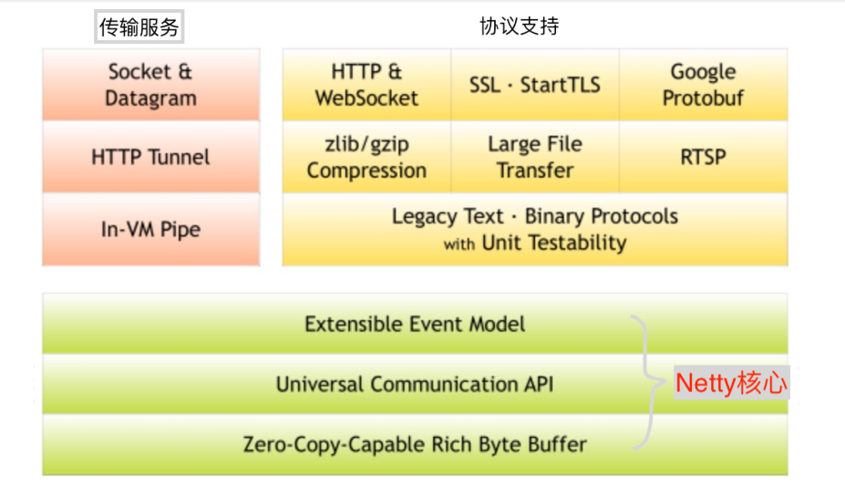

### Socket IO -> NIO

- 阻塞 -> 基于事件驱动的异步处理，多路复用器轮询监听连接事件，如有事件发生进行处理
- 多路复用器能同时处理多个连接

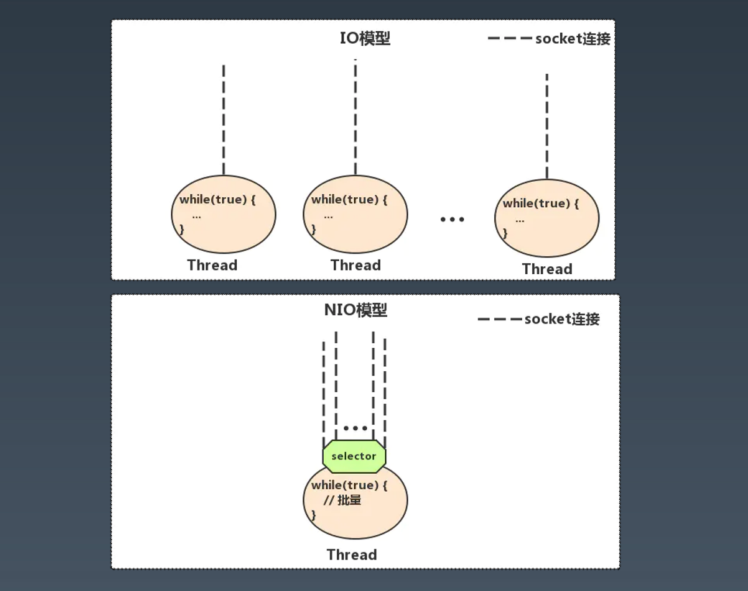

### Socket IO -> NIO--BIO

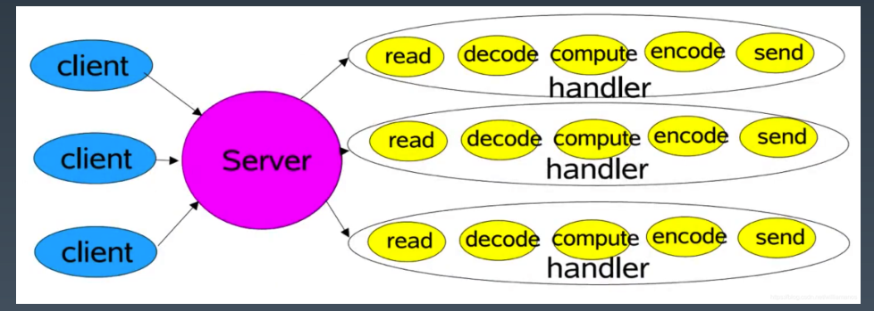

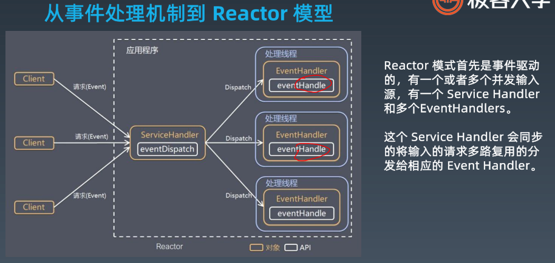

### Reactor单线程 模型 -> Netty NIO

- 单线程下的模型，只有一个 Selector ，轮询监听事件，如果有事件，停止轮询，处理事件，这样会出现一个问题就是处理单个事件时间过程 也会出现阻塞。

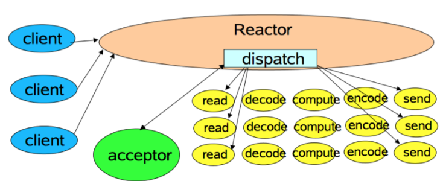

- Netty 的实现是

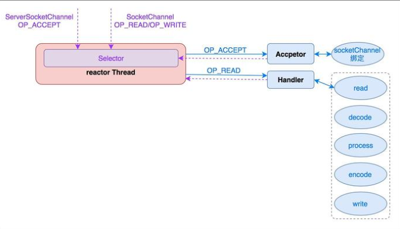

### Reactor 多线程模型 -> Netty NIO

- 多线程下的 Reactor ，分工更加明确，固定一个 多路复用器进行轮询监听事件，如果有事件连接，处理好连接后，将读写操作的监听事件交由 worker thread 处理

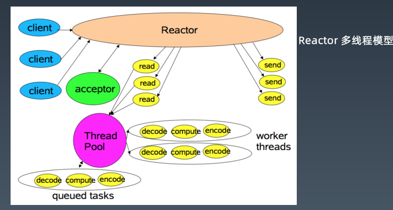

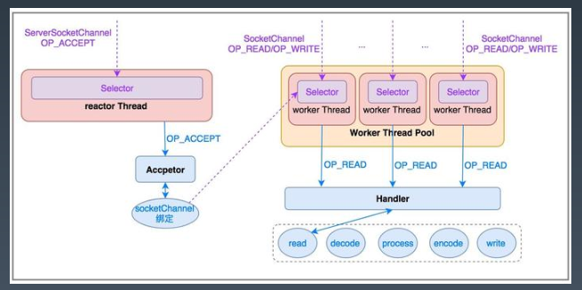

### Reactor 主从模型

- 将多路复用器升级成多线程模式

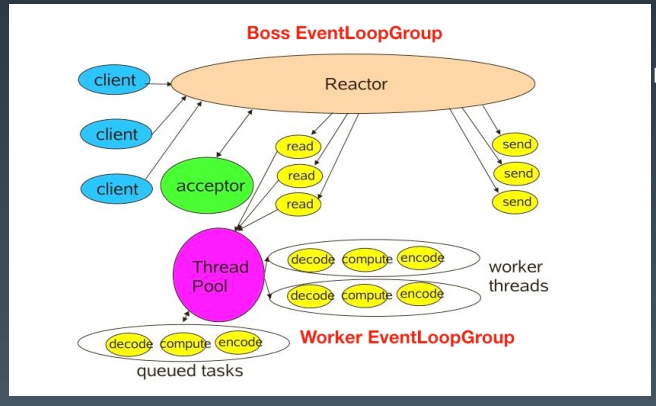

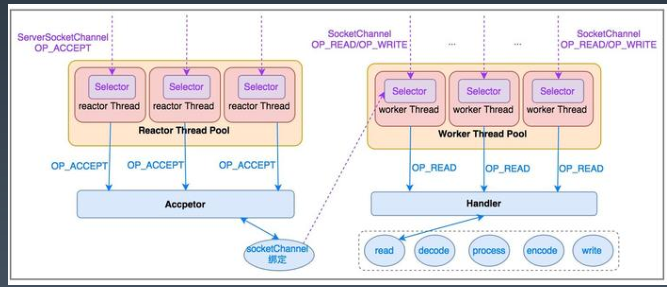

### Netty 对 Reactor 三种模式的支持

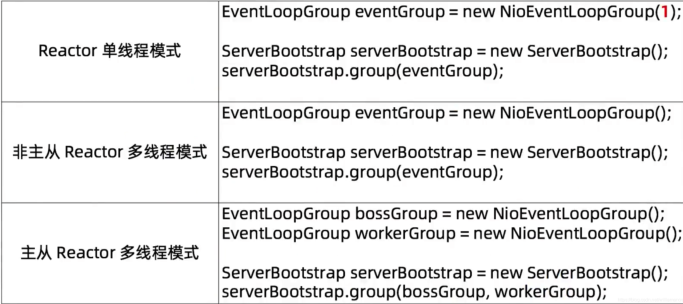

### Netty 的启动流程和处理

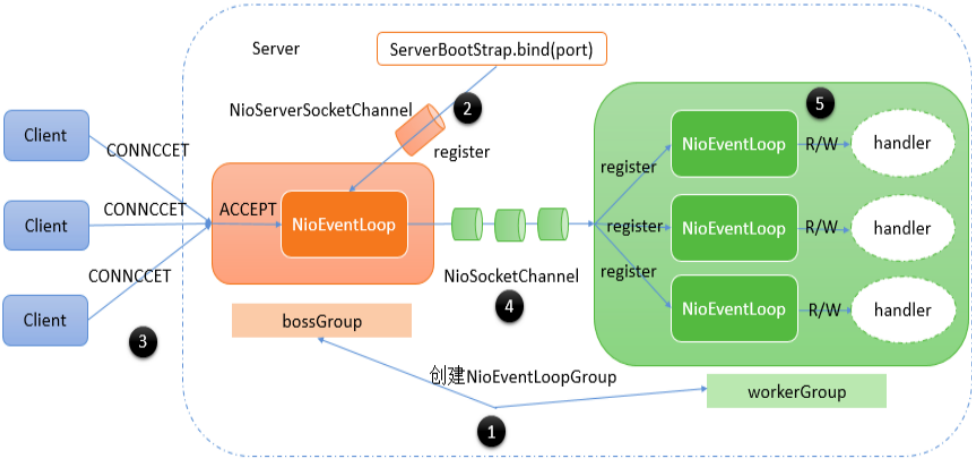

### Netty 线程模式

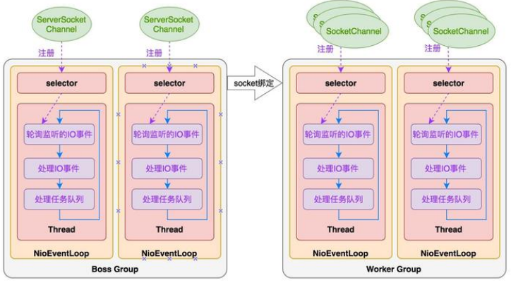

### Netty 核心对象

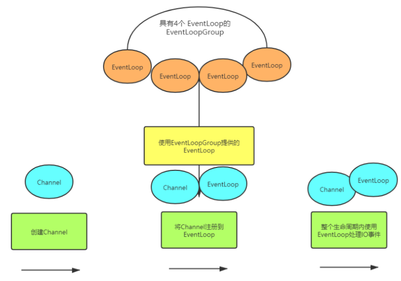

EventLoop 是一个线程池同时也是一个轮询器（多路复用器）

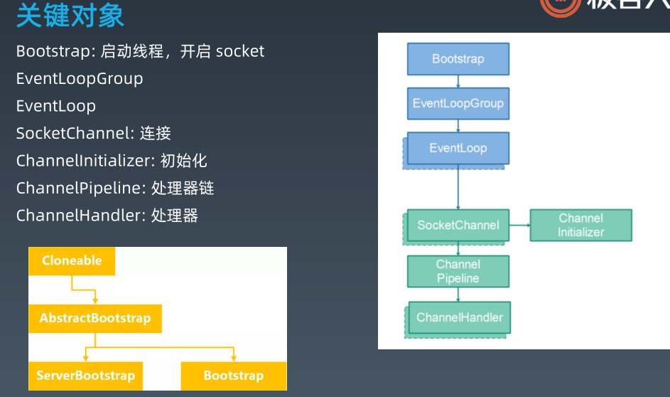

### Event 和 Handler

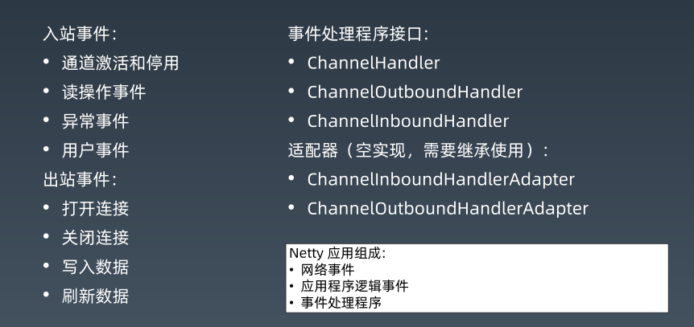

## Netty 网络程序优化

### 粘包与拆包

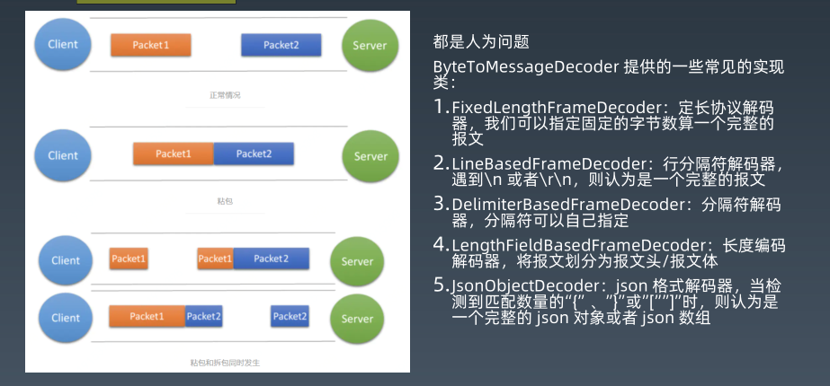

### Nagle 与 TCP_NODELAYMTU

- 最大报文段长度（MSS）与最大传输单元（Maximum Transmission Unit, MTU）均是协议用来定义最大长度的。不同的是，MTU应用于OSI模型的第二层数据链接层，并无具体针对的协议。MTU限制了数据链接层上可以传输的数据包的大小，也因此限制了上层（网络层）的数据包大小。
- 一次数据包发送传输最大的数据大小是 MTU（一般是1500 Byte），而 MSS: Maxitum Segment Size最大分段大小，为1460，其中少了 40 Byte 原因是 TCP 和 HTTP 各占了20 Byte 数据头
- 如果内容只有 1Byte 那么发一个数据包的大小就为 41 Byte，这样传输效率不高

Nagle 可以 缓冲区满 和 达到超时 在发送

### 优化连接

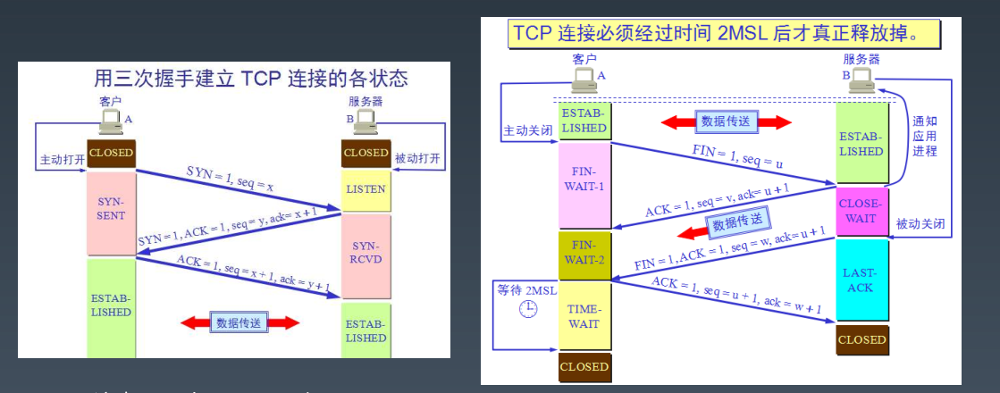

为什么是三次握手四次挥手，本质上都是四次，只是第二次握手的时候顺便应答了

[TIME-WAIT = 2MSL？](https://blog.csdn.net/xiaofei0859/article/details/6044694)

### Netty 优化

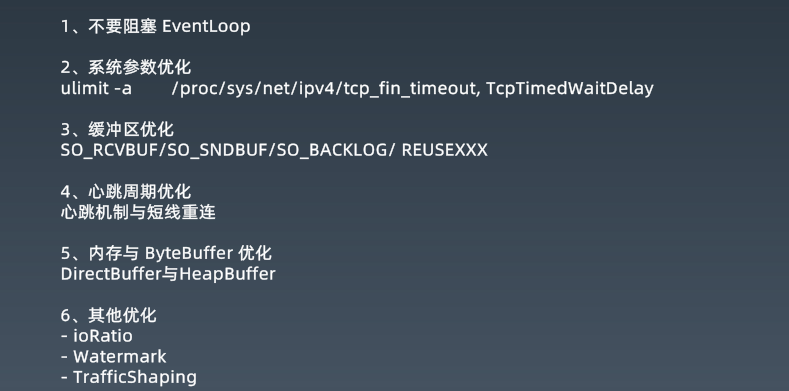

## API 网关

### 网关的结构和功能

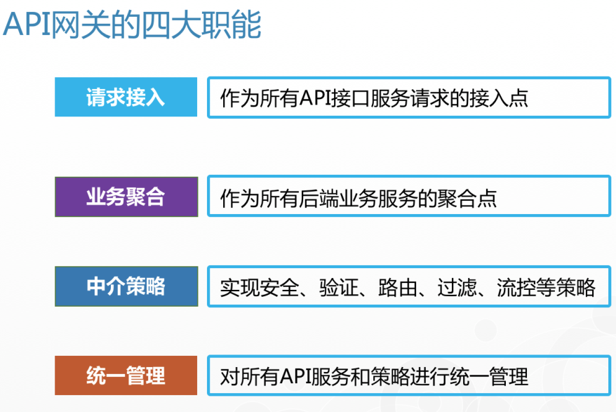

### 分类

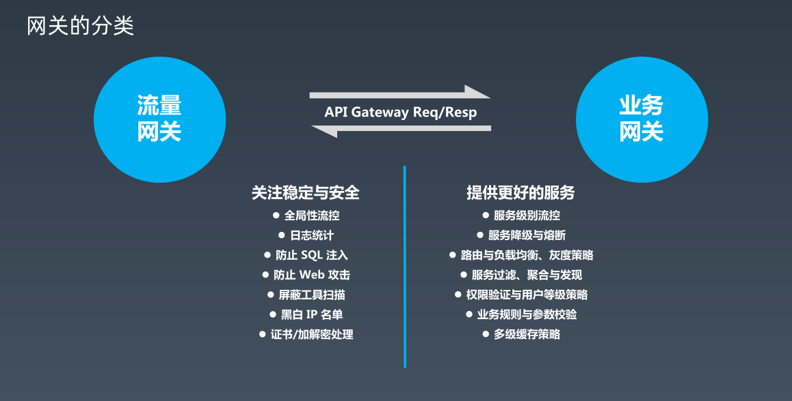

#### Zuul

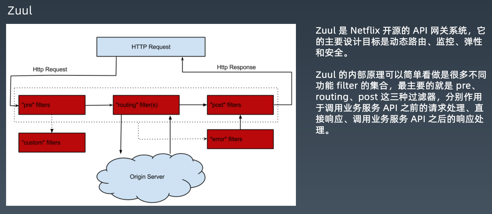

#### Zuul2

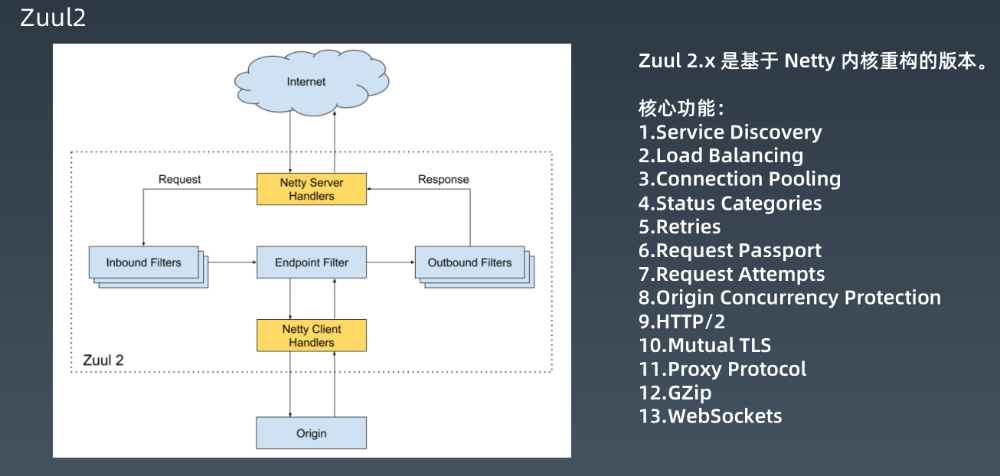

#### Spring Cloud Gateway

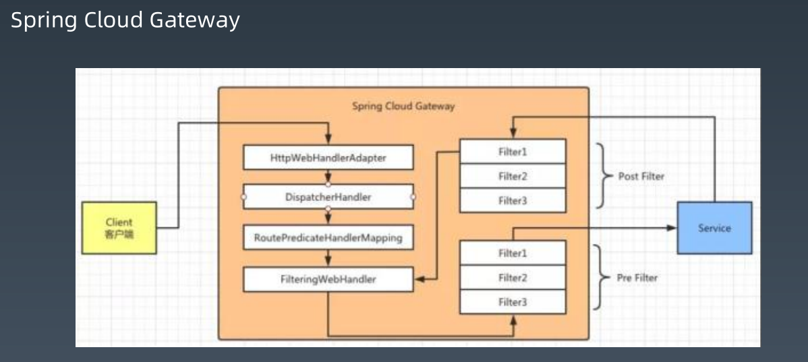