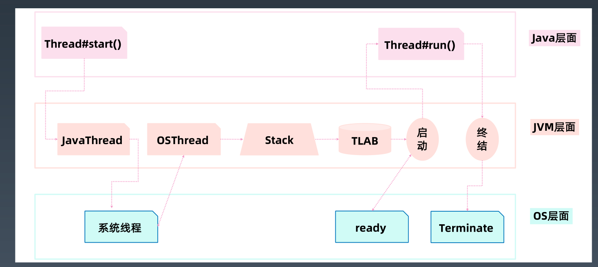
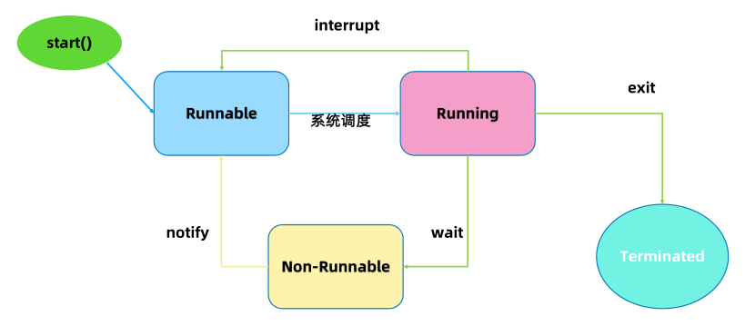
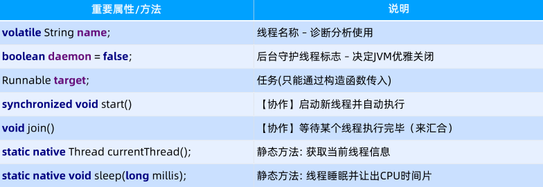
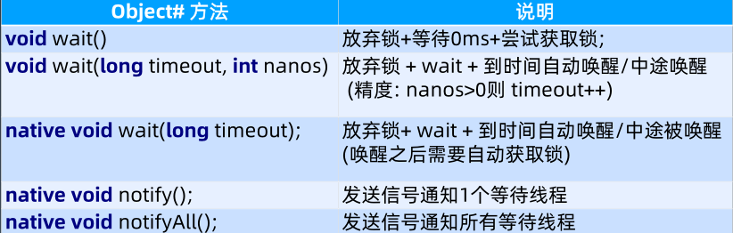
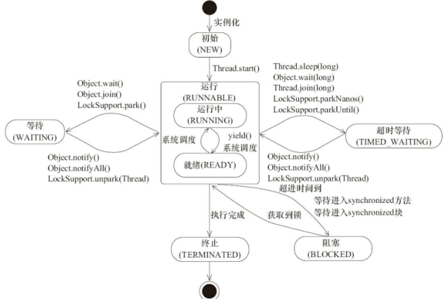
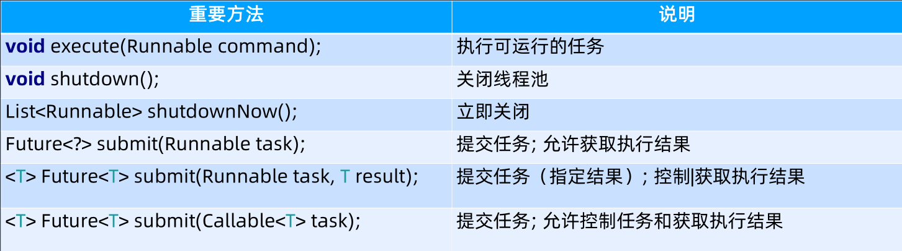
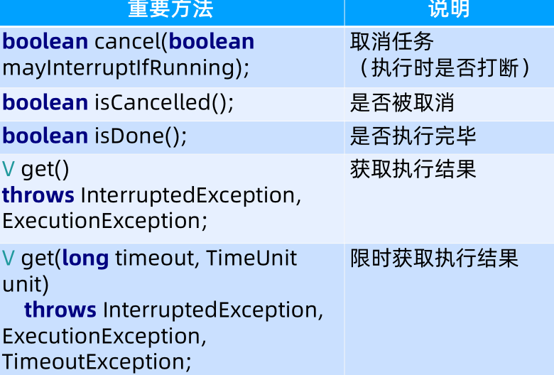

# Java 并发编程

## 1.多线程基础

**为什么会有多线程？**

- 摩尔定律失效，多核 + 分布式时代的来临

**Java 线程的创建过程**

- java 代码层面，线程开始启动，JVM 虚拟机会向操作系统申请一个系统线程进行绑定
- 待绑定好系统线程，JVM 会为每一个线程分配一个栈和线程本地分配缓存区
- JVM 层面的线程通知系统线程，线程进入就绪状态，等待 CPU 的调用
- 当 CPU 的时钟分配到该线程，线程开始被执行，会执行Java层面中的 run()
- Java 层面的run方法执行完成后，调用JVM层面的线程通知需要总结该线程
- JVM 层面的线程通知操作系统的线程终结，JVM 线程资源释放

## 2.Java 多线程

- 基于接口 Runnable
- 继承 Thread 类，本质还是基于 Runnable

**线程状态转换**

### Thread 类重要方法

### wait & notify

> wait 和 sleep 的区别
>
> sleep ： 释放 CPU 但是不释放锁，暂停指定时间自动唤醒
>
> wait：释放 CPU 也释放 锁，等待指定时间或者被中途唤醒

### Thread 的状态改变操作

1. Thread.sleep(long millis),当前线程进入 TIMED_WAITING 状态，但是不释放锁，苏醒后直接进入就绪状态
   - 作用：给其他线程执行机会的最佳时机
   - running-> sleep - > runnable 
2. Thread.yield(),当前线程放弃获取CPU时间片，但是不释放资源，运行状态由运行中转为就绪，让操作系统重新选择运行的线程
   - 作用：让相同优先级的线程轮流执行，但并不保证一定会轮流执行，实际无法达到让步的目的
   - running -> runnable
3. t.join / t.join(long millis),当前线程里调用其它线程 t 的 join 方法，当前线程进入WAITING/TIMED_WAITING 状态,当前线程不会释放已经持有的对象锁,线程t执行完毕或者 millis 时间到，当前线程进入就绪状态
   - 作用：可以进行线程间的等待
   - 当前线程 ： running -> wait -> notify -> runnable 
4. obj.wait()，当前线程调用对象的 wait() 方法，当前线程释放对象锁，进入等待队列。依靠 notify()/notifyAll() 唤醒或者 wait(long timeout) timeout 时间到自动唤醒
   - 作用：进行线程间的协调，可以让出资源给其他线程运行
   - running -> wait -> notify / interrupt -> runnable
5. obj.notify() 唤醒在此对象监视器上等待的单个线程，选择是任意性的。notifyAll() 唤醒在此对象监视器上等待的所有线程。
   - 作用：唤醒 wait 状态的线程，继续争夺锁后继续运行

### Thread 的中断与异常处理

1. 线程内部自己处理异常，不溢出到外层
2. 如果线程被 Object.wait、Thread.join 和 Thread.sleep 三种方法之一阻塞，此时调用该线程的 interrupt 方法，那么该线程将抛出一个 InterruptedException 中断异常，该线程必须事先预备好处理此异常，从而提早地终结被阻塞状态。如果线程没有被阻塞，这时调用interrupt() 将不起作用，直到执行到 wait(),sleep(),join() 时,才马上会抛出InterruptedException。

### 线程详细状态转换

## 3.线程安全

多线程会遇到什么问题？

多个线程竞争同一资源时，如果对资源的访问顺序敏感，就称存在竞态条件，导致竞态条件发送的代码称之为临界区。不进行恰当的控制，会导致线程安全问题

### 并发性质

- 原子性：操作不可被中断，一次性完成，或者失败
- 可见性，一个变量变量被 volatile 修饰时，他会保证修改的值立即被更新到主存，当其他线程需要读取时，他会去内存中读取新值
  - synchronized 和 Lock 也是可以保证可见性，synchronized 和 Lock 能保证同一时刻只有一个线程获取锁然后执行同步代码，并且在释放锁之前会将对变量的修改刷新到主存当中。
  - **可见性的本质就是修改完要刷回主存**

> volatile  保证不了原子性：
>
> volatile方式的i++，总共是四个步骤：
>
> i++实际为load、Increment、store、Memory Barriers 四个操作。
>
> 内存屏障是线程安全的,但是内存屏障之前的指令并不是.在某一时刻线程1将i的值load取出来，放置到cpu缓存中，然后再将此值放置到寄存器A中，然后A中的值自增1（寄存器A中保存的是中间值，没有直接修改i，因此其他线程并不会获取到这个自增1的值）。如果在此时线程2也执行同样的操作，获取值i==10,自增1变为11，然后马上刷入主内存。此时由于线程2修改了i的值，实时的线程1中的i==10的值缓存失效，重新从主内存中读取，变为11。接下来线程1恢复。将自增过后的A寄存器值11赋值给cpu缓存i。这样就出现了线程安全问题。

- 有序性：Java 允许编译器和处理器对指令进行重排序，但是重排序过程不会影响到单线程程序的执行，却会影响到多线程并发执行的正确性。可以通过 volatile 关键字来保证一定的“有序性”（synchronized 和 Lock也可以）。
- happens-before 原则（先行发生原则）
  -  程序次序规则：一个线程内，按照代码先后顺序
  -  锁定规则：一个 unLock 操作先行发生于后面对同一个锁的 lock 操作
  - Volatile 变量规则：对一个变量的写操作先行发生于后面对这个变量的读操作
  - 传递规则：如果操作 A 先行发生于操作 B，而操作 B 又先行发生于操作 C，则可以得出 A 先于 C
  - 线程启动规则：Thread 对象的 start() 方法先行发生于此线程的每个一个动作
  - 线程中断规则：对线程 interrupt() 方法的调用先行发生于被中断线程的代码检测到中断事件的发生
  - 线程终结规则：线程中所有的操作都先行发生于线程的终止检测，我们可以通过 Thread.join() 方法结束、Thread.isAlive() 的返回值手段检测到线程已经终止执行
  - 对象终结规则：一个对象的初始化完成先行发生于他的 finalize() 方法的开始

### synchronized

1. 使用对象头标记字(Object monitor)
2. Synchronized 方法优化
3. 偏向锁: BiaseLock
4. 保证了可见性和原子性

### volatile

1. 每次读取都强制从主内存刷数据
2. 适合场景：单个线程写；多个线程读
3. 满足可见性；不满足原子性
4. 指令重排
5. 原则：能不用就不用，不确定就不用，替代可以是 Atomic 原子操作类

### final

1. 修饰类，不允许继承
2. 修饰方法，不允许重写
3. 修饰变量，不允许修改
4. 修饰类变量，不允许变更
5. 能定义成 final 就定义

## 4.线程池原理与应用

### 线程池

1. Excutor: 执行者顶层接口
2. ExcutorService：接口 API
3. ThreadFactory：线程工程
4. Excutors: 工具类

#### Excutor

从线程池功能上看，就是一个任务执行器

#### ExecutorService

### 线程池参数

#### 缓存队列

BlockingQueue 是双缓冲队列。BlockingQueue 内部使用两条队列，允许两个线程同时向队列一个存储，一个取出操作。在保证并发安全的同时，提高了队列的存取效率。

1. ArrayBlockingQueue:规定大小的 BlockingQueue，其构造必须指定大小。其所含的对象是 FIFO 顺序排序的。
2. LinkedBlockingQueue:大小不固定的 BlockingQueue，若其构造时指定大小，生成的 BlockingQueue 有大小限制，不指定大小，其大小有 Integer.MAX_VALUE 来决定。其所含的对象是 FIFO 顺序排序的。
3. PriorityBlockingQueue:类似于 LinkedBlockingQueue，但是其所含对象的排序不是 FIFO，而是依据对象的自然顺序或者构造函数的 Comparator 决定。
4. SynchronizedQueue:特殊的 BlockingQueue，对其的操作必须是放和取交替完成

#### 拒绝策略

1. ThreadPoolExecutor.AbortPolicy:丢弃任务并抛出 RejectedExecutionException异常
2. ThreadPoolExecutor.DiscardPolicy：丢弃任务，但是不抛出异常。
3. ThreadPoolExecutor.DiscardOldestPolicy: 丢弃队列最前面的任务，然后重新提交被拒绝的任务
4. ThreadPoolExecutor.CallerRunsPolicy：由调用线程（提交任务的线程）处理改任务

### 创建线程池方法

1. newSingleThreadExecutor

   **创建一个单线程的线程池**。这个线程池只有一个线程在工作，也就是相当于单线程串行执行所有任务。如果这个唯一的线程因为异常结束，那么会有一个新的线程来替代它。此线程池保证所有任务的执行顺序按照任务的提交顺序执行。

2. newFixedThreadPool

   **创建固定大小的线程池**。每次提交一个任务就创建一个线程，直到线程达到线程池的最大大小。线程池的大小一旦达到最大值就会保持不变，如果某个线程因为执行异常而结束，那么线程池会补充一个新线程

3. newCachedThreadPool

   **创建一个可缓存的线程池**。如果线程池的大小超过了处理任务所需要的线程那么就会回收部分空闲（60秒不执行任务）的线程，当任务数增加时，此线程池又可以智能的添加新线程来处理任务。此线程池不会对线程池大小做限制，线程池大小完全依赖于操作系统（或者说JVM）能够创建的最大线程大小

4. newScheduledThreadPool

   创建一个大小无限的线程池。此线程池支持**定时以及周期性执行任务**的需求

### Callable & Future

- Runnable#run() 没有返回值

- Callable#call() 方法有返回值

- Future 有返回值并且提供了更加多的接口

  

